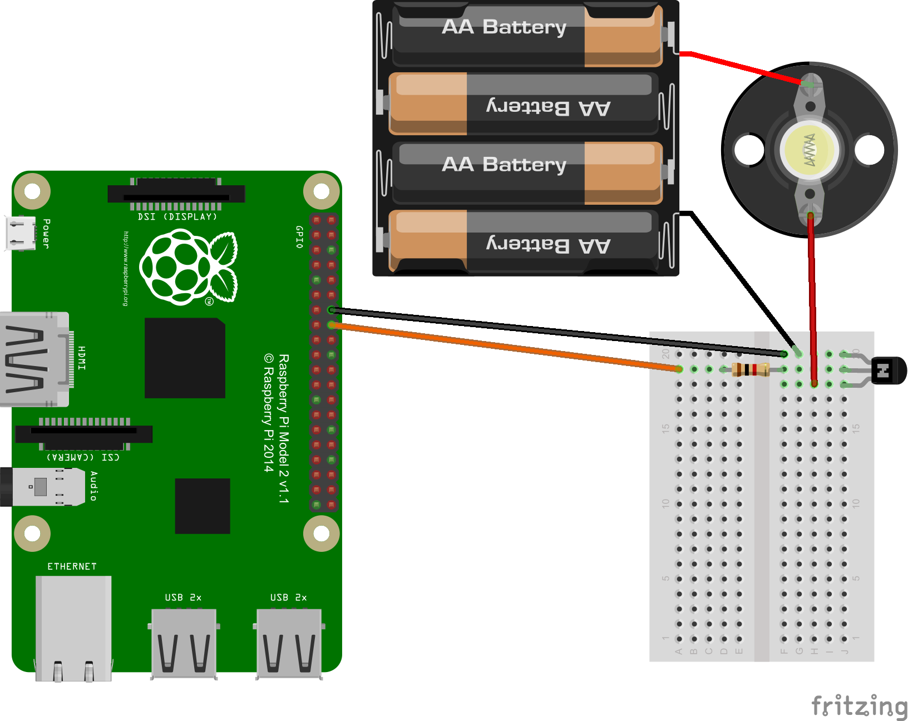
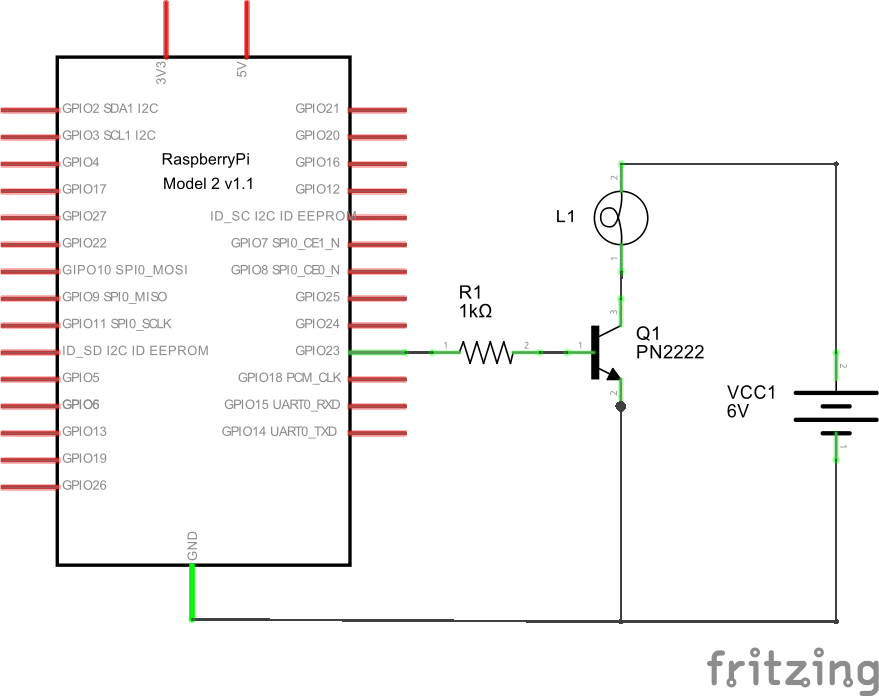

# fritzing-bulb-holder

## Introduction

The Fritzing software tool allows users to document their electronics
prototypes. However, as at version 0.9.2b, the library of parts included with
the software does not include an incandescent light bulb.

Users can import their own parts. This project seeks to add the following parts:

* bulb_holder_E10_with_base: a holder for an E10 light bulb with a black base.

## Example

